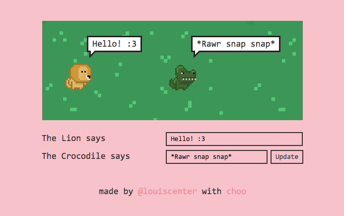

# Using input fields with choo
🌐 Made by [@louiscenter](https://twitter.com/louiscenter) 🌐

✨ This guide will help demonstrate the use of input fields within a simple interactive `choo` application

## choo handbook
This guide has been published at [https://handbook.choo.io/using-input-fields](https://handbook.choo.io/using-input-fields).

## Who is guide this for?
To follow along, you should be comfortable with the basics of JavaScript, HTML & CSS.

You should also feel comfortable with the basics of `choo`. If you haven't already, complete the [your-first-choo-app](https://handbook.choo.io/your-first-choo-app) guide before starting this one. It's a good introduction to what `choo` is, and how it works.

## What will we build?
For this guide, we're going to build a variation of the animal simulator we built in the [your-first-choo-app](https://handbook.choo.io/your-first-choo-app) tutorial, that will allow our animals to talk to one another. I call it `choo-talking-animals`.

This is what it looks like:

[](https://choo-talking-animals.glitch.me)

Using the provided input fields, a user can change what each animal is saying to the other. The lion's input field will work slightly differently to the crocodile's input field, and this should help demonstrate the basic ways in which input fields can update our application's state.

You can try the finished version of this app here: [https://choo-talking-animals.glitch.me](https://choo-talking-animals.glitch.me)

## Let's get started!
For this guide, we will be using the [Glitch](https://glitch.com/) code editor.

If you're not familiar with how Glitch works, you should refer to the `Let's get started` section in our [your-first-choo-app](https://handbook.choo.io/your-first-choo-app) tutorial.

If you're already familiar with Glitch, open the following starter project URL, remix/fork the project and let's begin: [https://glitch.com/edit/#!/project/choo-talking-animals-starter](https://glitch.com/edit/#!/project/choo-talking-animals-starter)

## Creating input fields
With our starter project loaded, let's have a look at what code is provided for us. Click the `index.js` file in Glitch's left sidebar, and make sure that you see the following:

```js
// import choo
var choo = require('choo')

// import template
var main = require('./templates/main')

// initialize choo
var app = choo()

// declare routes
app.route('/', main)

// start app
app.mount('div')
```

First, we are importing the `choo` framework, as well as a pre-made HTML template into our codebase. We then initialize an instance of `choo` (stored in the `app` variable), and then create a new `/` route which points to the template we imported above. Finally, we mount the app to our webpage using the `mount()` function, which simultaneously starts the application when everything has finished loading.

Let's take a look at the template which we imported, and stored in the `main` variable. Click on the `templates/main.js` file in Glitch's left sidebar, and make sure that you see the following:

```js
// import html helper
var html = require('choo/html')

// export function
module.exports = function (state, emit) {
  return html`
    <div class="container">
      <div class="grass">
        <div class="lion">
          
          <div class="bubble"></div>
        </div>

        <div class="crocodile">
          
          <div class="bubble"></div>
        </div>
      </div>
    </div>
  `
}
```

At the top of this file, we've imported the `html` function that comes with `choo`, which allows us to create HTML templates that `choo` can understand and render on the page. Below, we're exporting a function that returns a template which will render a square of grass, a lion, a crocodile and some speech bubbles (the assets and CSS styles for these HTML elements are included with the starter project).

We can see what our app currently looks like, by clicking the "Show" button near the top left hand corner of the window:


Let's add some input fields to our application. Modify the HTML template inside `template/main.js` to read the following:

```html
<div class="container">
  <div class="grass">
    <div class="lion">
      
      <div class="bubble"></div>
    </div>

    <div class="crocodile">
      
      <div class="bubble"></div>
    </div>
  </div>

  <div class="inputs">
    <div class="input">
      <div class="label">The Lion says</div>
      <input type="text" id="lion" />
    </div>

    <div class="input">
      <div class="label">The Crocodile says</div>
      <input type="text" id="crocodile" />
      <button>Update</button>
    </div>
  </div>
</div>
```

Let's see what our app looks like now:


Below our grass square (`<div class="grass">`), we've a added new container (`<div class="inputs">`) which includes two input fields (`<input type="text" />`), and a `<button>`. The first input field is for our Lion, and the second input field is for our Crocodile. At this point, if we type some text into one of these inputs, or click on the button, nothing will happen. However, we can add properties to these elements which will trigger a function when an interaction occurs.

## Adding event handlers to inputs
The idea of this application is that it should demonstrate two different ways in which we can get text from an input field to our application's state.

One way we can do this is by detecting when the contents of an input field has changed. In response, we can pass this updated input value to our application's state.

Let's update the code of our first input field:

```html
<div class="input">
  <div class="label">The Lion says</div>
  <input type="text" id="lion" oninput=${updateLion} />
</div>
```

We've now added an `oninput` property to our first `<input />` element. If you completed the previous guide in this handbook, `your-first-choo-app`, you might be familiar with the `onclick` property, which we used to detect click events on certain elements in our templates. `oninput` is very similar: it executes a specified function whenever input is detected.

We've specified that `oninput` should trigger a function called `updateLion()`, so let's declare that function underneath our template:

```js
// export function
module.exports = function (state, emit) {
  return html`
    <div class="container">
      ...
    </div>
  `

  // update what lion says
  function updateLion (e) {
    emit('updateAnimal', {
      type: 'lion',
      value: e.target.value
    })
  }
}
```

A lot of new things are happening here, so let's break this down:

- Below our template, we've created a new function called `updateLion()`. It has one parameter, `e`, which contains information about the `<input />` field that initially triggered the function.

- Inside `updateLion()`, we're calling the `emit()` function, which will allow us to emit an event to `choo`'s event bus. Later, we can listen for this event to update our application's state.

- When calling `emit()`, we pass in two arguments: a string of the event name we'd like to emit (`'updateAnimal'`), and then an object which is passed to our event listener. This object contains data we can use to update our application's state later on.

If we try changing the value of our first input field, we still won't see any changes above:


We are still yet to send the changes from our input field to our application's state, so let's do that next.

## Updating state
In our `templates/index.js` file, when the `updateLion()` function is executed, it emits an event to `choo`'s event bus called `updateAnimal`. An object is also passed along with this event, which contains a `type` property, and a `value` property. As we are updating the Lion's input field, `type` is equal to `'lion'`, and `value` is equal to `e.target.value`. This variable contains the text value of the input field which triggered `updateLion()`.

Now that our template is emitting an event, let's listen for this same event back in our `index.js` file, and use it to update our application's state.

Update `index.js` to read the following:

```js
// import choo
var choo = require('choo')

// import template
var main = require('./templates/main')

// initialize choo
var app = choo()

app.use(function (state, emitter) {
  // initialize app state
  state.animals = {
    lion: 'Hello! :3',
    crocodile: '*Rawr snap snap*'
  }

  // update state
  emitter.on('updateAnimal', function (data) {
    state.animals[data.type] = data.value
    emitter.emit('render')
  })
})

// declare routes
app.route('/', main)

// start app
app.mount('div')
```

Above our route declaration, we're now calling and passing a function into `app.use()`, allowing us to first initialize our application's state, and then update it when the `updateAnimal` event is emitted. Let's breakdown this part of the code:

- First we create an object which we assign to `state.animals`. This object has two properties, `state.animals.lion` and `state.animals.crocodile`. These both contain strings which will act first as the default value for each animal's speech bubble, and then the values for each speech bubble after they are updated.

- Next, we create an event listener called `updateAnimal` using the `emitter.on()` function. When this event listener receives data, it passes a value (`data.value`), to its corresponding `state.animals` property (if the value of `data.type` is equal to `lion`, then `state.animals.lion` is updated).

- Finally, when our application's `state` object is updated, we call `emitter.emit('render')` to re-render the page.

Let's try our application now:


Hmm, that's weird. When we try entering text into our first input field, nothing happens at all. It doesn't even seem to register the input from our keyboard.

What is going on here?

The input field *is* in fact receiving data from our keyboard, and our state *is* in fact being updated. We have to make some additional changes to our template before this can work properly.

Head back to the `templates/index.js` file, and update the HTML template to read the following:

```js
// import html helper
var html = require('choo/html')

// export template function
module.exports = function (state, emit) {
  var lion = state.animals.lion
  var crocodile = state.animals.crocodile

  return html`
    <div class="container">
      <div class="grass">
        <div class="lion">
          
          <div class="bubble">${lion}</div>
        </div>

        <div class="crocodile">
          
          <div class="bubble">${crocodile}</div>
        </div>
      </div>

      <div class="inputs">
        <div class="input">
          <div class="label">The Lion says</div>
          <input type="text" id="lion" value=${lion} oninput=${updateLion} />
        </div>

        <div class="input">
          <div class="label">The Crocodile says</div>
          <input type="text" id="crocodile" />
          <button>Update</button>
        </div>
      </div>
    </div>
  `

  // update what lion says
  function updateLion (e) {
    emit('updateAnimal', {
      type: 'lion',
      value: e.target.value
    })
  }
}

```

Before we dissect all the changes we just made, let's try our application again:


It's working! Our animals can now talk, and we can make the Lion say whatever is on our mind.

Let's run through a list of what just changed:

- At the top of our template function, we created two new variables, `lion` and `crocodile`, which point to `state.animals.lion` and `state.animals.crocodile` respectively.

- Next, inside of each animal's speech bubble, we render those variables (eg. `<div class="bubble">${lion}</div>`), so that we can see what each animal is saying.

- Finally, we added a `value` property to our first input field. We set this property to be equal to the `lion` variable, the same variable used inside of the Lion's speech bubble.

Prior to these changes, when we entered text into our first input field, nothing on the screen was updated, not even the input field itself.

The important change here is the new `value` property we added to the `<input />` element. When this element detects new input from the keyboard, it runs the `updateLion()` function. This then emits the `updateAnimal` event, which first updates our `state.animals` object, and then triggers `emitter.emit('render')`, re-rendering our application.

If `choo` re-renders, but an `<input />` element's `value` property isn't set to anything, `choo` will re-render that element *without* any value. Thus we end up with the effect that nothing is being updated at all.

## Minimizing re-renders
This application is starting to work a lot better now, but depending on what kind of behaviour you'd like your input fields and forms to exhibit, re-rendering the application after each keystroke might not be ideal.

There's another way in which we can transfer information from an input field, to our application state, without all of the extra re-rendering.

Let's make a change to the Crocodile's input field, and the `<button>` element sitting next to it, in `templates/index.js`:

```html
<div class="label">The Crocodile says</div>
  <input type="text" id="crocodile" value=${crocodile} />
  <button onclick=${updateCrocodile}>Update</button>
</div>
```

Like before, we've added a `value` property to this input field, and set its value to the `crocodile` variable. However, you may have noticed that we didn't add an `oninput` property. Instead, we've added an `onclick` property to the `<button>` element, which is set to trigger a function called `updateCrocodile()` when an interaction occurs.

To finish, let's add the `updateCrocodile()` function below the `updateLion()` function:

```js
// update what lion says
function updateLion (e) {
  emit('updateAnimal', {
    type: 'lion',
    value: e.target.value
  })
}

// update what crocodile says
function updateCrocodile () {
  emit('updateAnimal', {
    type: 'crocodile',
    value: document.getElementById('crocodile').value
  })
}
```

This is the last bit of code we'll write in this guide, so let's see how our app looks now. Switch to the application view, change the value of the Crocodile's input field, and press the `Update` button:


Awesome! Both inputs are now working, and we can change what both animals are saying to each other. Let's look closer at what our second input field is doing, and then figure out how these two input fields differ from each other:

- First, the user changes the value of the Crocodile's input field, and then presses the `<button />` element labelled "Update".

- This then triggers the `updateCrocodile()` function, which then triggers the `emit()` function. We emit `updateAnimal` to `choo`'s event bus, and pass in an object, just like we do in our `updateLion()` function from earlier.

- The object we pass into `emit()` here differs slightly from the one inside of `updateLion()`: its `type` property is set to `'crocodile'`, and its `value` property is set to `document.getElementById('crocodile').value`.

The difference between these two approaches is mainly in the way we are obtaining the value of each input field:

- In the first example, because we are running `updateLion()` after each key stroke, we can set the value of our application's state to the value of the `<input />` element each time.

- In the second example, we only run `updateCrocodile()` when the "Update" `<button>` is clicked. As the interaction arises from the `<button>` element, we must manually reach out to the `<input />` element we're interested in and obtain its value, and we do this by using `document.getElementById('crocodile').value()`.
